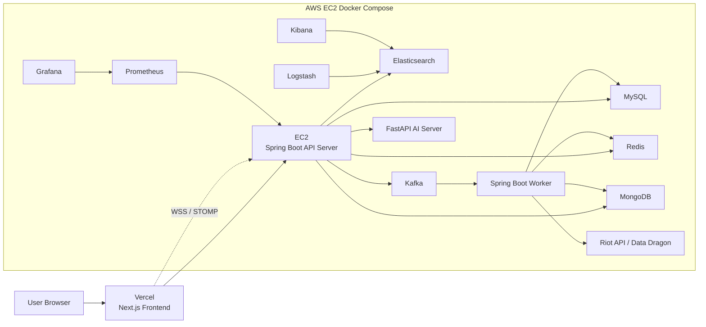

# Arcane

Arcane is a League of Legends match history, champion analytics, guide, realtime chat, and AI score experimentation platform.

The project was built as a full-stack service around Riot API data. It focuses on practical service problems such as external API rate limits, duplicated match data, asynchronous data collection, production deployment, OAuth authentication, WebSocket chat, search performance, and observability.

## Live Services

- Frontend: https://www.ar-cane.site
- API Server: https://api.ar-cane.site

## Architecture



## Tech Stack

| Area | Stack |
| --- | --- |
| Frontend | Next.js, React, TypeScript, Tailwind CSS, React Query, STOMP |
| API Server | Java 21, Spring Boot, Spring Security, OAuth2, JWT, JPA |
| Worker Server | Spring Boot, Kafka Consumer, Riot API data collection |
| AI Server | FastAPI, Python, model inference experiment |
| Data | MySQL, MongoDB, Redis, Elasticsearch |
| Messaging | Kafka |
| Infra | Docker, Docker Compose, AWS EC2, Vercel, Nginx, Certbot, GitHub Actions, GHCR |
| Observability | Actuator, Micrometer, Prometheus, Grafana, Logstash, Kibana |

## Main Features

- Riot ID based summoner search
- Match history lookup and refresh flow
- Riot API response caching and duplicated match ID filtering
- Ranking data collection and Redis cache
- MongoDB participant-level match raw data storage
- Worker-based dataset collection and champion analysis
- Champion tier list and role-specific champion statistics
- Champion detail page with item, rune, spell, and position usage data
- Guide board, image upload through S3, comments, and realtime chat
- Google/Naver OAuth login and JWT based API authentication
- Elasticsearch guide search and summoner autocomplete experiments
- Grafana/Prometheus server metrics and ELK log monitoring
- Vercel frontend deployment and EC2 backend Docker deployment
- GitHub Actions CI/CD for backend, worker, and AI server images

## Key Engineering Work

- Separated long-running Riot API data collection and analysis from user-facing API requests through Kafka and Worker server.
- Stored Riot match raw data in MongoDB by participant document and reused match data by deduplicating match IDs.
- Precomputed champion statistics into MySQL analysis tables to reduce tier/stat lookup latency from heavy on-request calculation to precomputed reads.
- Added Redis cache and lock-based flows to reduce repeated external API calls on cache misses.
- Added Docker Compose profiles for local and EC2 deployment, with Vercel handling the frontend.
- Added GHCR-based GitHub Actions deployment to EC2.
- Fixed production WebSocket deployment by configuring Nginx `Upgrade` / `Connection` proxy headers and opening `/ws/**` in Spring Security.
- Added Riot product verification file at `/riot.txt` for Production API Key review.

## Repository Structure

```text
.
├── frontend/Arcane_Frontend       # Next.js frontend
├── backend/Arcane_Backend         # Spring Boot API server
├── worker                         # Spring Boot worker server
├── ai/Arcane_AI                   # FastAPI AI server
├── docker                         # Logstash, Prometheus, Nginx examples
├── docs                           # Architecture, deployment, operation docs
├── docker-compose.yml             # Local all-in-one compose
├── docker-compose.ec2.yml         # EC2 production compose
└── docker-compose.ec2.build.yml   # EC2 direct build override
```

## Documentation

Start from [docs/README.md](docs/README.md).

Important documents:

- [System Architecture](docs/ARCANE_ARCHITECTURE.md)
- [Project Status](docs/PROJECT_STATUS.md)
- [Operations History](docs/OPERATIONS_HISTORY.md)
- [Vercel + EC2 Deployment](docs/DEPLOYMENT_VERCEL_EC2.md)
- [GitHub Actions CI/CD](docs/GITHUB_ACTIONS_CICD.md)
- [Riot Production API Key Guide](docs/RIOT_API_PRODUCTION.md)
- [Security Checklist](docs/SECURITY_CHECKLIST.md)
- [Runbook](docs/RUNBOOK.md)

## Local Development

Local development usually runs infrastructure with Docker and app servers directly.

```bash
docker compose up -d arcane-db redis kafka mongodb elasticsearch
```

API server:

```bash
cd backend/Arcane_Backend
./gradlew bootRun
```

Frontend:

```bash
cd frontend/Arcane_Frontend
npm install
npm run dev
```

AI server:

```bash
cd ai/Arcane_AI
python -m venv .venv
source .venv/bin/activate
python -m pip install -r requirements.txt
python -m uvicorn main:app --host 127.0.0.1 --port 8864 --reload
```

## Production Deployment

- Frontend is deployed through Vercel Git integration.
- Backend, Worker, and AI server Docker images are built by GitHub Actions and pushed to GHCR.
- EC2 pulls GHCR images and restarts services with `docker-compose.ec2.yml`.
- Nginx terminates HTTPS for `api.ar-cane.site` and proxies to the API server on port `8080`.

## Security

Real secrets must not be committed.

Use environment variables for:

- Riot API key
- OAuth client secrets
- JWT secrets
- Database password
- AWS S3 credentials
- GHCR token
- EC2 SSH private key

See [docs/SECURITY_CHECKLIST.md](docs/SECURITY_CHECKLIST.md).

## Riot Disclaimer

Arcane is not endorsed by Riot Games and does not reflect the views or opinions of Riot Games or anyone officially involved in producing or managing League of Legends. League of Legends and Riot Games are trademarks or registered trademarks of Riot Games, Inc.
