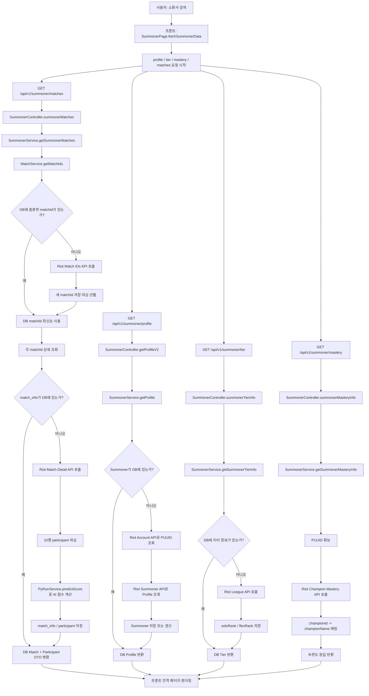
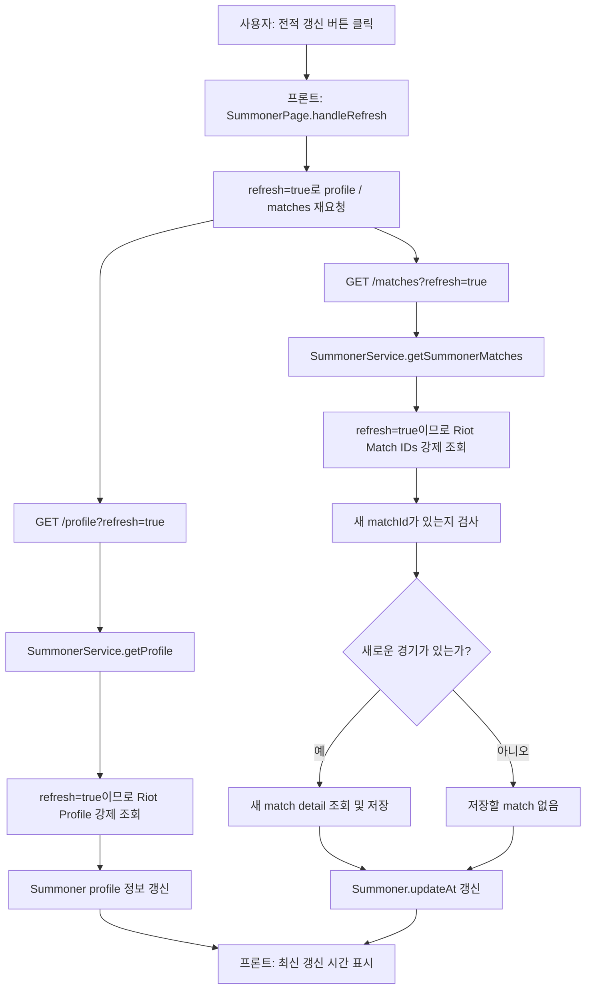
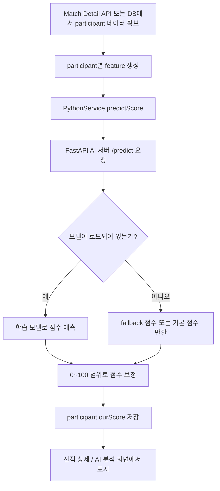
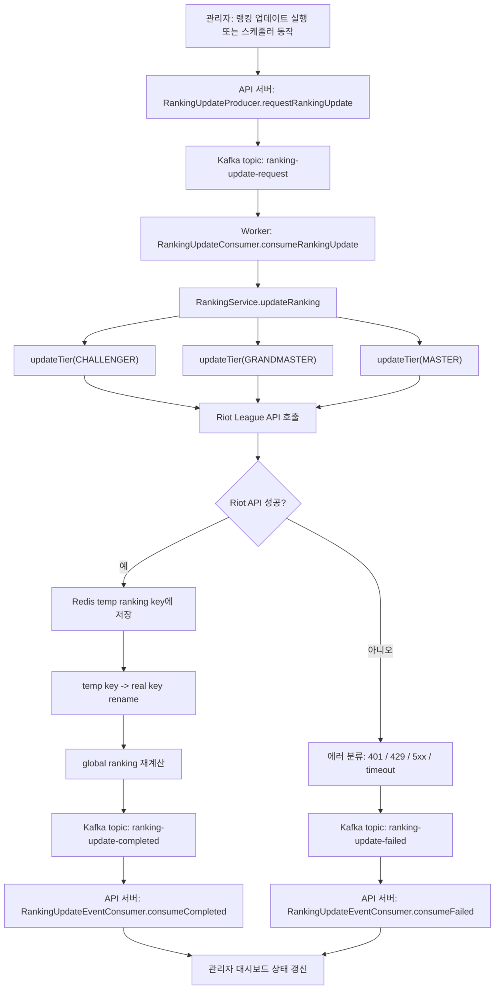
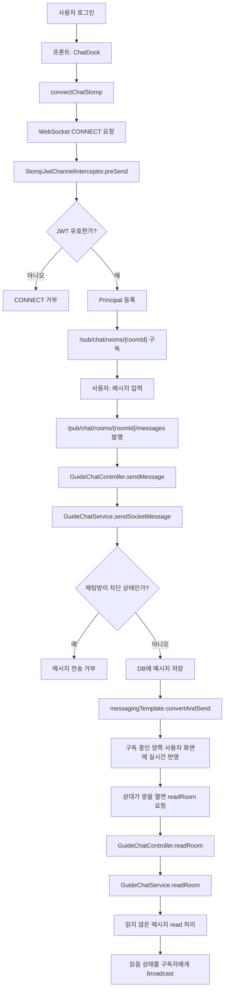
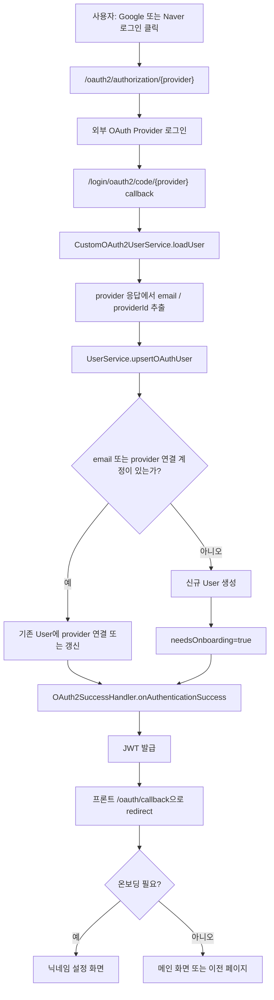
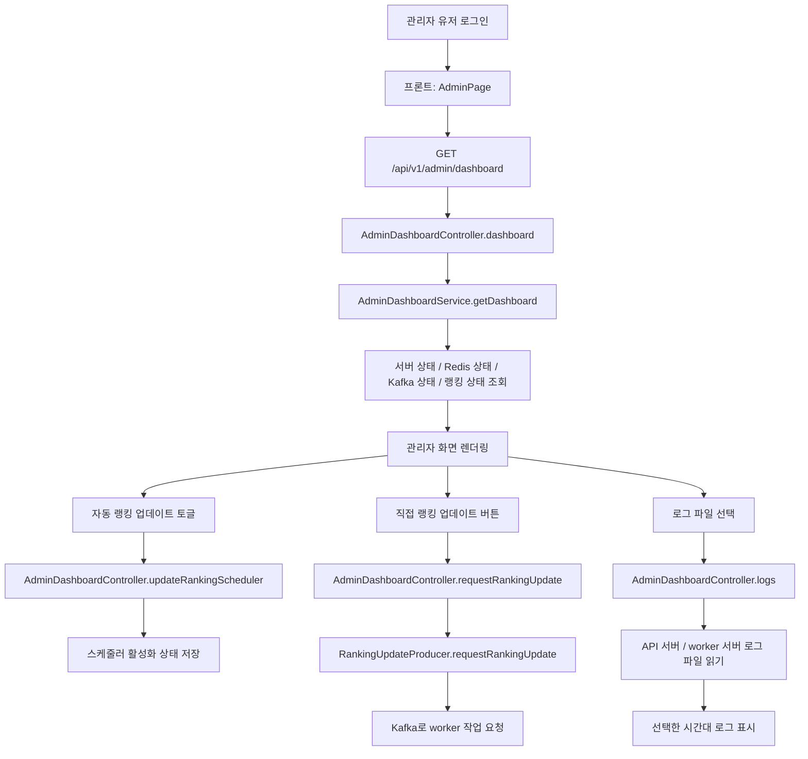
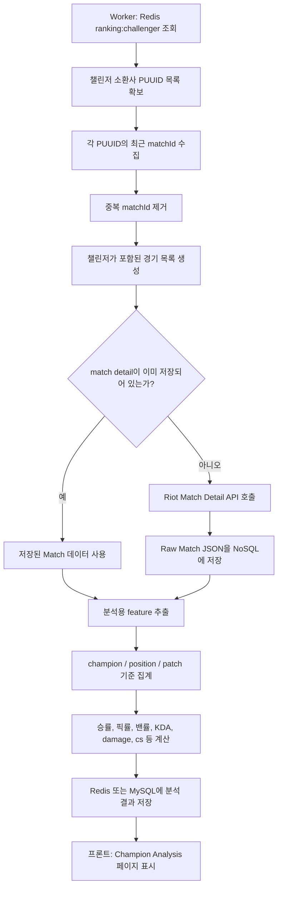
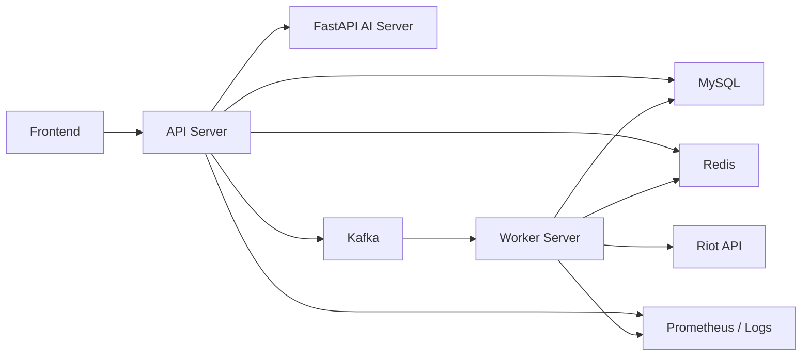

# ARCANE Logic Flow

기준일: 2026-06-08  
위치: `backend/Arcane_Backend/ARCANE_LOGIC_FLOW.md`  
정리 기준: `파일명 / method명 / 역할`

## 1. 전적 검색 흐름

| 파일명 | method명 | 역할 |
|---|---|---|
| `src/main/java/com/arcane/Arcane/Riot/Summoner/controller/v1/SummonerController.java` | `getProfileV2` | 소환사 프로필 정보를 조회한다. 기본은 DB 우선, `refresh=true`면 Riot API로 강제 갱신한다. |
| `src/main/java/com/arcane/Arcane/Riot/Summoner/controller/v1/SummonerController.java` | `summonerTierInfo` | 소환사 티어 정보를 조회한다. Summoner가 있어도 티어 정보가 비어 있으면 Riot API로 보강한다. |
| `src/main/java/com/arcane/Arcane/Riot/Summoner/controller/v1/SummonerController.java` | `summonerMasteryInfo` | 소환사의 챔피언 숙련도 정보를 조회한다. |
| `src/main/java/com/arcane/Arcane/Riot/Summoner/controller/v1/SummonerController.java` | `summonerMatches` | 전적 목록을 조회한다. matchId 조회, Match DB 조회, Riot API 호출, AI 점수 계산까지 포함한다. |
| `src/main/java/com/arcane/Arcane/Riot/Summoner/service/SummonerService.java` | `getProfile` | 프로필 캐시 조회 후 필요 시 Riot API에서 프로필 정보를 가져와 Summoner를 저장/갱신한다. |
| `src/main/java/com/arcane/Arcane/Riot/Summoner/service/SummonerService.java` | `getSummonerTierInfo` | DB에 티어 정보가 있으면 반환하고, 없거나 `refresh=true`면 Riot API에서 티어를 받아 저장한다. |
| `src/main/java/com/arcane/Arcane/Riot/Summoner/service/SummonerService.java` | `getSummonerMasteryInfo` | PUUID를 구한 뒤 Riot API에서 챔피언 숙련도 정보를 가져오고 챔피언 이름을 매핑한다. |
| `src/main/java/com/arcane/Arcane/Riot/Summoner/service/SummonerService.java` | `getSummonerMatches` | 전적 검색의 핵심 메소드. matchId 20개 기준으로 Match/Participant를 구성하고 AI Score를 계산한다. |
| `src/main/java/com/arcane/Arcane/Riot/Summoner/service/SummonerService.java` | `findSummoner` | gameName/tagLine으로 Summoner DB 캐시를 조회한다. |
| `src/main/java/com/arcane/Arcane/Riot/Summoner/service/SummonerService.java` | `findPuuid` | DB에 Summoner가 있으면 PUUID를 재사용하고, 없으면 Riot Account API로 PUUID를 조회한다. |
| `src/main/java/com/arcane/Arcane/Riot/Summoner/service/SummonerService.java` | `findOrCreateSummoner` | Match 참가자 정보를 기반으로 Summoner가 없으면 새로 저장한다. |
| `src/main/java/com/arcane/Arcane/Riot/Summoner/service/SummonerService.java` | `markSummonerRefreshed` | 전적 갱신 후 Summoner의 `updateAt`을 최신 시간으로 갱신한다. |
| `src/main/java/com/arcane/Arcane/Riot/Match/service/MatchService.java` | `getMatchIds` | `refresh=false`면 DB의 matchId를 우선 사용하고, 부족하거나 `refresh=true`면 Riot API에서 matchId를 가져온다. |
| `src/main/java/com/arcane/Arcane/Riot/Match/service/MatchService.java` | `getMatchByMatchId` | matchId로 Match DB 캐시를 조회한다. |
| `src/main/java/com/arcane/Arcane/Riot/Match/service/MatchService.java` | `saveIfAbsent` | matchId 중복 저장을 방지하면서 Match를 저장한다. |
| `src/main/java/com/arcane/Arcane/Riot/Match/service/MatchWriteService.java` | `saveNewMatch` | Match와 MatchParticipant를 DB에 저장한다. |
| `src/main/java/com/arcane/Arcane/Score/service/PythonService.java` | `predictScore` | FastAPI AI 서버의 `/predict`로 참가자 지표를 보내 AI Score를 계산한다. 실패 시 fallback 점수를 반환한다. |

## 2. 전적 상세 / 빌드 / 타임라인 흐름

| 파일명 | method명 | 역할 |
|---|---|---|
| `src/main/java/com/arcane/Arcane/Riot/Summoner/controller/v1/SummonerController.java` | `getMatchTimeline` | 특정 matchId와 PUUID 기준으로 한 참가자의 타임라인 이벤트를 조회한다. |
| `src/main/java/com/arcane/Arcane/Riot/Summoner/controller/v1/SummonerController.java` | `getMatchTimelineByParticipants` | 특정 matchId의 모든 참가자별 타임라인 이벤트를 조회한다. |
| `src/main/java/com/arcane/Arcane/Riot/Match/service/MatchService.java` | `findEvents` | 특정 참가자 PUUID의 타임라인 이벤트를 가져온다. |
| `src/main/java/com/arcane/Arcane/Riot/Match/service/MatchService.java` | `findEventsByMatchId` | matchId 기준으로 참가자 전체 타임라인 이벤트를 가져온다. |
| `src/main/java/com/arcane/Arcane/Riot/Match/service/MatchTimelineService.java` | `getEventsTimelineByPuuid` | Riot timeline 원본 JSON에서 특정 PUUID가 관여한 이벤트만 추출한다. |
| `src/main/java/com/arcane/Arcane/Riot/Match/service/MatchTimelineService.java` | `getEventsTimelineByMatchId` | Riot timeline 원본 JSON을 참가자 PUUID별 이벤트 Map으로 변환한다. |
| `src/main/java/com/arcane/Arcane/Riot/Match/service/MatchTimelineService.java` | `isUserInvolved` | 이벤트의 `participantId`, `creatorId`, `killerId`, `victimId`, assist 목록을 기준으로 해당 유저 관련 이벤트인지 판단한다. |
| `src/main/java/com/arcane/Arcane/Riot/RiotInform/service/RiotApiService.java` | `getMatchTimeline` | Riot Match Timeline API를 호출해 timeline 원본 JSON을 가져온다. |

## 3. Riot API 연동 흐름

| 파일명 | method명 | 역할 |
|---|---|---|
| `src/main/java/com/arcane/Arcane/Riot/RiotInform/service/RiotApiService.java` | `getSummonerInfo` | Riot Account API에서 gameName/tagLine 기준으로 PUUID를 조회한다. |
| `src/main/java/com/arcane/Arcane/Riot/RiotInform/service/RiotApiService.java` | `getSummonerTierInfo` | Riot League API에서 소환사 티어 정보를 조회한다. |
| `src/main/java/com/arcane/Arcane/Riot/RiotInform/service/RiotApiService.java` | `getProfileInfo` | Riot Summoner API에서 프로필 아이콘, 레벨 정보를 조회한다. |
| `src/main/java/com/arcane/Arcane/Riot/RiotInform/service/RiotApiService.java` | `getMasteryInfo` | Riot Champion Mastery API에서 숙련도 정보를 조회한다. |
| `src/main/java/com/arcane/Arcane/Riot/RiotInform/service/RiotApiService.java` | `getSummonerMatchesV3` | Riot Match API에서 최근 matchId 목록을 조회한다. |
| `src/main/java/com/arcane/Arcane/Riot/RiotInform/service/RiotApiService.java` | `getMatchInfo` | Riot Match API에서 match detail 정보를 조회한다. |
| `src/main/java/com/arcane/Arcane/Riot/RiotInform/service/RiotApiService.java` | `getMinimalMatchInfo` | 시즌/통계용 최소 Match 정보를 조회한다. |

## 4. 랭킹 조회 / 랭킹 업데이트 흐름

| 파일명 | method명 | 역할 |
|---|---|---|
| `src/main/java/com/arcane/Arcane/Riot/Ranker/controller/RankerController.java` | `getChallRanks` | Redis의 Challenger 랭킹을 페이지 단위로 조회한다. |
| `src/main/java/com/arcane/Arcane/Riot/Ranker/controller/RankerController.java` | `getGrandMasterRanks` | Redis의 Grandmaster 랭킹을 페이지 단위로 조회한다. |
| `src/main/java/com/arcane/Arcane/Riot/Ranker/controller/RankerController.java` | `getMASTERRanks` | Redis의 Master 랭킹을 페이지 단위로 조회한다. |
| `src/main/java/com/arcane/Arcane/Riot/Ranker/controller/RankerController.java` | `getALLRanks` | Challenger, Grandmaster, Master 통합 랭킹을 조회한다. |
| `src/main/java/com/arcane/Arcane/Riot/Ranker/service/RankerService.java` | `getRankersByKey` | Redis key 기준으로 랭커 목록을 조회한다. |
| `src/main/java/com/arcane/Arcane/Riot/Ranker/service/RankerService.java` | `updateGlobalRanking` | 티어별 랭킹 Redis 데이터를 합쳐 전체 랭킹을 만든다. |
| `src/main/java/com/arcane/Arcane/Riot/Ranker/RankerScheduler.java` | `run` | 20분마다 랭킹 업데이트를 실행하도록 Kafka 이벤트를 발행한다. |
| `src/main/java/com/arcane/Arcane/Common/Kafka/producer/RankingUpdateProducer.java` | `requestRankingUpdate` | API 서버에서 worker 서버로 랭킹 업데이트 요청 Kafka 메시지를 발행한다. |
| `src/main/java/com/arcane/Arcane/Common/Kafka/consumer/RankingUpdateEventConsumer.java` | `consumeCompleted` | worker의 랭킹 업데이트 성공 이벤트를 소비해 job 상태를 완료 처리한다. |
| `src/main/java/com/arcane/Arcane/Common/Kafka/consumer/RankingUpdateEventConsumer.java` | `consumeFailed` | worker의 랭킹 업데이트 실패 이벤트를 소비해 job 상태를 실패 처리한다. |
| `src/main/java/com/arcane/Arcane/Common/Kafka/service/RankingUpdateJobStatusService.java` | `markPublished` | 랭킹 업데이트 요청이 Kafka로 발행된 상태를 기록한다. |
| `src/main/java/com/arcane/Arcane/Common/Kafka/service/RankingUpdateJobStatusService.java` | `markCompleted` | worker 완료 이벤트를 기준으로 랭킹 업데이트 job을 성공 처리한다. |
| `src/main/java/com/arcane/Arcane/Common/Kafka/service/RankingUpdateJobStatusService.java` | `markFailed` | worker 실패 이벤트를 기준으로 랭킹 업데이트 job을 실패 처리한다. |

## 5. Worker 서버 랭킹 처리 흐름

| 파일명 | method명 | 역할 |
|---|---|---|
| `../worker/src/main/java/com/arcane/worker/kafka/consumer/RankingUpdateConsumer.java` | `consumeRankingUpdate` | API 서버가 발행한 랭킹 업데이트 요청 메시지를 소비한다. |
| `../worker/src/main/java/com/arcane/worker/ranker/service/RankingService.java` | `updateRanking` | Challenger, Grandmaster, Master 랭킹을 순서대로 갱신하고 전체 랭킹을 병합한다. |
| `../worker/src/main/java/com/arcane/worker/ranker/service/RankingService.java` | `updateTier` | 특정 티어의 Riot 랭킹 데이터를 가져와 Redis에 저장한다. |
| `../worker/src/main/java/com/arcane/worker/ranker/service/RankingService.java` | `requestLeagueByTier` | Riot 랭킹 API 호출 실패/429를 재시도 처리한다. |
| `../worker/src/main/java/com/arcane/worker/ranker/service/RankingService.java` | `getRankerObject` | Riot 랭킹 응답을 Redis 저장용 DTO로 변환한다. |
| `../worker/src/main/java/com/arcane/worker/ranker/service/RankingService.java` | `updateScore` | 랭커 점수를 Summoner DB에 반영한다. |
| `../worker/src/main/java/com/arcane/worker/ranker/service/RankingService.java` | `downloadRankersProfile` | 랭커들의 프로필 정보가 부족하면 Riot API로 보강한다. |
| `../worker/src/main/java/com/arcane/worker/ranker/service/RankingService.java` | `storeProfile` | Redis 랭커 PUUID 목록을 순회하며 프로필을 저장한다. |
| `../worker/src/main/java/com/arcane/worker/riot/service/RiotApiService.java` | `getLeagueByTier` | Riot League API에서 티어별 랭킹 원본을 조회한다. |
| `../worker/src/main/java/com/arcane/worker/riot/service/RiotApiService.java` | `getSummonerByPuuid` | PUUID로 Riot Account 정보를 조회한다. |
| `../worker/src/main/java/com/arcane/worker/riot/service/RiotApiService.java` | `getProfileInfo` | Riot Summoner API에서 아이콘/레벨 정보를 조회한다. |
| `../worker/src/main/java/com/arcane/worker/redis/RedisService.java` | `updateRedisRanking` | 티어별 랭킹을 임시 key에 저장 후 실제 key로 교체한다. |
| `../worker/src/main/java/com/arcane/worker/redis/RedisService.java` | `updateGlobalRanking` | 티어별 랭킹을 합쳐 전체 랭킹 Redis key를 만든다. |
| `../worker/src/main/java/com/arcane/worker/summoner/service/SummonerService.java` | `getSummonerByPuuid` | worker에서 Summoner DB를 PUUID 기준으로 조회한다. |
| `../worker/src/main/java/com/arcane/worker/summoner/service/SummonerService.java` | `saveSummoner` | Riot Account 정보를 기반으로 Summoner를 새로 저장한다. |
| `../worker/src/main/java/com/arcane/worker/summoner/service/SummonerService.java` | `updateRankerScore` | 티어/LP/승패 정보를 Summoner에 반영한다. |
| `../worker/src/main/java/com/arcane/worker/summoner/service/SummonerService.java` | `updateProfile` | 프로필 아이콘과 레벨 정보를 Summoner에 반영한다. |

## 6. OAuth / JWT / 사용자 흐름

| 파일명 | method명 | 역할 |
|---|---|---|
| `src/main/java/com/arcane/Arcane/Common/Config/SecurityConfig.java` | `filterChain` | 보안 필터, OAuth2 로그인, JWT 필터, CORS, 권한 정책을 설정한다. |
| `src/main/java/com/arcane/Arcane/Common/Auth/oauth/CustomOAuth2UserService.java` | `loadUser` | Google/Naver OAuth 사용자 정보를 읽고 Arcane User와 연결한다. |
| `src/main/java/com/arcane/Arcane/Common/Auth/oauth/OAuth2SuccessHandler.java` | `onAuthenticationSuccess` | OAuth 로그인 성공 후 JWT를 발급하고 프론트 callback URL로 리다이렉트한다. |
| `src/main/java/com/arcane/Arcane/Common/Auth/oauth/OAuth2FailureHandler.java` | `onAuthenticationFailure` | OAuth 로그인 실패 사유를 프론트 실패 페이지로 전달한다. |
| `src/main/java/com/arcane/Arcane/Common/Auth/oauth/OAuthUserInfo.java` | `from` | provider별 OAuth 응답을 공통 사용자 정보로 변환한다. |
| `src/main/java/com/arcane/Arcane/Common/Auth/jwt/JwtUtil.java` | `createToken` | 로그인 사용자에게 JWT를 생성한다. |
| `src/main/java/com/arcane/Arcane/Common/Auth/jwt/JwtUtil.java` | `parseClaims` | JWT payload를 파싱한다. |
| `src/main/java/com/arcane/Arcane/Common/Auth/jwt/JwtUtil.java` | `isTokenValid` | JWT 유효성을 검증한다. |
| `src/main/java/com/arcane/Arcane/Common/Auth/jwt/JwtAuthenticationFilter.java` | `doFilterInternal` | HTTP 요청의 Bearer 토큰을 검증하고 SecurityContext에 인증 정보를 넣는다. |
| `src/main/java/com/arcane/Arcane/Web/User/controller/v1/UserController.java` | `login` | 일반 로그인 요청을 처리한다. |
| `src/main/java/com/arcane/Arcane/Web/User/controller/v1/UserController.java` | `me` | 현재 로그인한 사용자 정보를 반환한다. |
| `src/main/java/com/arcane/Arcane/Web/User/controller/v1/UserController.java` | `completeOAuthOnboarding` | OAuth 최초 로그인 사용자의 별명 설정을 완료한다. |
| `src/main/java/com/arcane/Arcane/Web/User/controller/v1/UserController.java` | `createOAuthLinkIntent` | 기존 계정에 다른 OAuth provider를 연결하기 위한 의도를 만든다. |
| `src/main/java/com/arcane/Arcane/Web/User/controller/v1/UserController.java` | `updateNickName` | 내 정보 페이지에서 닉네임을 변경한다. |
| `src/main/java/com/arcane/Arcane/Web/User/service/UserService.java` | `login` | 일반 로그인 인증 후 JWT를 발급한다. |
| `src/main/java/com/arcane/Arcane/Web/User/service/UserService.java` | `upsertOAuthUser` | OAuth 사용자를 생성하거나 기존 User와 연결한다. |
| `src/main/java/com/arcane/Arcane/Web/User/service/UserService.java` | `linkOAuthAccount` | 로그인된 사용자 계정에 Google/Naver 계정을 추가 연결한다. |
| `src/main/java/com/arcane/Arcane/Web/User/service/UserService.java` | `completeOAuthOnboarding` | 신규 OAuth 사용자의 닉네임 설정과 가입 완료 상태를 저장한다. |
| `src/main/java/com/arcane/Arcane/Web/User/service/UserService.java` | `updateNickName` | 닉네임 중복 검증 후 사용자 닉네임을 변경한다. |

## 7. 공략 / 댓글 / 채팅 흐름

| 파일명 | method명 | 역할 |
|---|---|---|
| `src/main/java/com/arcane/Arcane/Web/Guide/controller/GuideController.java` | `createGuide` | 로그인 사용자만 공략글을 작성한다. |
| `src/main/java/com/arcane/Arcane/Web/Guide/controller/GuideController.java` | `getGuideList` | 공략 게시글 목록을 조회한다. |
| `src/main/java/com/arcane/Arcane/Web/Guide/controller/GuideController.java` | `getGuideById` | 공략 상세를 조회하고 조회수를 반영한다. |
| `src/main/java/com/arcane/Arcane/Web/Guide/controller/GuideController.java` | `updateGuide` | 작성자가 공략글을 수정한다. |
| `src/main/java/com/arcane/Arcane/Web/Guide/controller/GuideController.java` | `deleteGuide` | 작성자가 공략글을 삭제한다. |
| `src/main/java/com/arcane/Arcane/Web/Guide/controller/GuideController.java` | `addLikeToGuide` | 공략글 좋아요를 처리한다. |
| `src/main/java/com/arcane/Arcane/Web/Guide/controller/GuideController.java` | `addDislikeToGuide` | 공략글 싫어요를 처리한다. |
| `src/main/java/com/arcane/Arcane/Web/Guide/service/GuideService.java` | `save` | 공략글을 DB에 저장한다. |
| `src/main/java/com/arcane/Arcane/Web/Guide/service/GuideService.java` | `findAll` | 공략 목록을 조회한다. |
| `src/main/java/com/arcane/Arcane/Web/Guide/service/GuideService.java` | `findById` | 공략 상세를 조회한다. |
| `src/main/java/com/arcane/Arcane/Web/Guide/service/GuideService.java` | `edit` | 공략 내용을 수정한다. |
| `src/main/java/com/arcane/Arcane/Web/Comment/controller/CommentController.java` | `writeGuideComment` | 공략글 댓글을 작성한다. |
| `src/main/java/com/arcane/Arcane/Web/Comment/controller/CommentController.java` | `editComment` | 댓글을 수정한다. |
| `src/main/java/com/arcane/Arcane/Web/Comment/controller/CommentController.java` | `deleteComment` | 댓글을 삭제한다. |
| `src/main/java/com/arcane/Arcane/Web/Comment/controller/CommentController.java` | `like` | 댓글 좋아요를 처리한다. |
| `src/main/java/com/arcane/Arcane/Web/Comment/controller/CommentController.java` | `dislike` | 댓글 싫어요를 처리한다. |
| `src/main/java/com/arcane/Arcane/Web/Comment/service/CommentService.java` | `saveGuideComment` | 공략 댓글을 DB에 저장한다. |
| `src/main/java/com/arcane/Arcane/Web/Comment/service/CommentService.java` | `addLikeById` | 댓글 좋아요 수를 증가시킨다. |
| `src/main/java/com/arcane/Arcane/Web/Comment/service/CommentService.java` | `addDislikeById` | 댓글 싫어요 수를 증가시킨다. |
| `src/main/java/com/arcane/Arcane/Web/Guide/controller/GuideChatController.java` | `getMyRooms` | 로그인 사용자의 채팅방 목록을 조회한다. |
| `src/main/java/com/arcane/Arcane/Web/Guide/controller/GuideChatController.java` | `openGuideRoom` | 공략 작성자와 독자의 채팅방을 생성하거나 기존 방을 반환한다. |
| `src/main/java/com/arcane/Arcane/Web/Guide/controller/GuideChatController.java` | `sendMessage` | REST 또는 STOMP 메시지를 받아 채팅 메시지를 저장/전송한다. |
| `src/main/java/com/arcane/Arcane/Web/Guide/controller/GuideChatController.java` | `readRoom` | STOMP로 채팅방 읽음 처리를 수행하고 구독자에게 방 상태를 전파한다. |
| `src/main/java/com/arcane/Arcane/Web/Guide/controller/GuideChatController.java` | `blockRoom` | 채팅방 차단을 처리한다. |
| `src/main/java/com/arcane/Arcane/Web/Guide/controller/GuideChatController.java` | `hideRoom` | 사용자 기준으로 채팅방 목록에서 숨김 처리한다. |
| `src/main/java/com/arcane/Arcane/Web/Guide/service/GuideChatService.java` | `findMyRooms` | 내 채팅방 목록과 읽지 않은 메시지 수를 계산한다. |
| `src/main/java/com/arcane/Arcane/Web/Guide/service/GuideChatService.java` | `openGuideRoom` | guideId/readerId 기준으로 중복 없는 채팅방을 연다. |
| `src/main/java/com/arcane/Arcane/Web/Guide/service/GuideChatService.java` | `sendSocketMessage` | STOMP 채팅 메시지를 저장하고 방 구독자에게 전송한다. |
| `src/main/java/com/arcane/Arcane/Web/Guide/service/GuideChatService.java` | `readRoom` | 상대 메시지를 읽음 처리한다. |
| `src/main/java/com/arcane/Arcane/Web/Guide/service/GuideChatService.java` | `blockRoom` | 양쪽 모두 더 이상 메시지를 보낼 수 없도록 방을 차단한다. |
| `src/main/java/com/arcane/Arcane/Common/Config/WebSocketConfig.java` | `registerStompEndpoints` | STOMP WebSocket 연결 endpoint를 등록한다. |
| `src/main/java/com/arcane/Arcane/Common/Config/WebSocketConfig.java` | `configureMessageBroker` | `/sub`, `/pub` 메시지 broker prefix를 설정한다. |
| `src/main/java/com/arcane/Arcane/Common/Auth/websocket/StompJwtChannelInterceptor.java` | `preSend` | STOMP CONNECT 요청의 JWT를 검증하고 Principal을 설정한다. |

## 8. 챔피언 분석 / 통계 흐름

| 파일명 | method명 | 역할 |
|---|---|---|
| `src/main/java/com/arcane/Arcane/Web/Statistics/controller/StatisticsController.java` | `getPositionTier` | 포지션별 챔피언 티어 통계를 조회한다. |
| `src/main/java/com/arcane/Arcane/Web/Statistics/controller/StatisticsController.java` | `getChampionDetail` | 특정 챔피언의 상세 통계를 조회한다. |
| `src/main/java/com/arcane/Arcane/Web/Statistics/controller/StatisticsController.java` | `getAllChampionsName` | 챔피언 목록/검색용 데이터를 조회한다. |
| `src/main/java/com/arcane/Arcane/Web/Statistics/service/StatisticsService.java` | `getTiers` | 포지션별 챔피언 티어 리스트를 생성한다. |
| `src/main/java/com/arcane/Arcane/Web/Statistics/service/StatisticsService.java` | `createAllPositionStatistics` | 전체 포지션 기준 통계를 생성한다. |
| `src/main/java/com/arcane/Arcane/Web/Statistics/service/StatisticsService.java` | `getChampionDetail` | 챔피언 상세 분석 데이터를 조립한다. |
| `src/main/java/com/arcane/Arcane/Web/Statistics/service/StatisticsService.java` | `getAllName` | 챔피언 검색용 이름 목록을 반환한다. |
| `src/main/java/com/arcane/Arcane/Riot/Match/service/MatchService.java` | `getStatisticsOfMostChampion` | 특정 PUUID의 시즌 챔피언별 플레이 통계를 Riot match 기반으로 집계한다. |

## 9. 패치노트 흐름

| 파일명 | method명 | 역할 |
|---|---|---|
| `src/main/java/com/arcane/Arcane/Web/PatchNote/controller/RiotPatchNoteController.java` | `findPatchNotes` | 공식 Riot 패치노트 목록을 크롤링/캐시 조회한다. |
| `src/main/java/com/arcane/Arcane/Web/PatchNote/controller/RiotPatchNoteController.java` | `findChampionPatchNotes` | 특정 챔피언 이름 기준으로 관련 패치노트를 필터링한다. |
| `src/main/java/com/arcane/Arcane/Web/PatchNote/controller/RiotPatchNoteController.java` | `clearCache` | 패치노트 크롤링 캐시를 초기화한다. |
| `src/main/java/com/arcane/Arcane/Web/PatchNote/service/RiotPatchNoteCrawlerService.java` | `findPatchNotes` | 공식 패치노트 페이지를 크롤링해 패치노트 목록을 만든다. |
| `src/main/java/com/arcane/Arcane/Web/PatchNote/service/RiotPatchNoteCrawlerService.java` | `findChampionPatchNotes` | 크롤링한 패치노트에서 챔피언 이름이 포함된 내용을 찾는다. |
| `src/main/java/com/arcane/Arcane/Web/PatchNote/service/RiotPatchNoteCrawlerService.java` | `clearCache` | 메모리 캐시를 비운다. |
| `src/main/java/com/arcane/Arcane/Web/PatchNote/controller/PatchNoteController.java` | `createPatchNote` | 직접 작성하는 패치노트 게시글을 저장한다. |
| `src/main/java/com/arcane/Arcane/Web/PatchNote/controller/PatchNoteController.java` | `findPatchNoteById` | 패치노트 상세를 조회한다. |
| `src/main/java/com/arcane/Arcane/Web/PatchNote/controller/PatchNoteController.java` | `findAllPatchNotes` | DB에 저장된 패치노트 목록을 조회한다. |

## 10. 관리자 / 모니터링 / 로그 흐름

| 파일명 | method명 | 역할 |
|---|---|---|
| `src/main/java/com/arcane/Arcane/Web/Admin/controller/AdminDashboardController.java` | `dashboard` | 관리자 대시보드 기본 정보를 조회한다. |
| `src/main/java/com/arcane/Arcane/Web/Admin/controller/AdminDashboardController.java` | `rankingSchedulerStatus` | 랭킹 자동 업데이트 활성화 상태를 조회한다. |
| `src/main/java/com/arcane/Arcane/Web/Admin/controller/AdminDashboardController.java` | `updateRankingScheduler` | 랭킹 자동 업데이트 활성화 여부를 변경한다. |
| `src/main/java/com/arcane/Arcane/Web/Admin/controller/AdminDashboardController.java` | `serverStatus` | 서버 상태/Actuator 기반 데이터를 조회한다. |
| `src/main/java/com/arcane/Arcane/Web/Admin/controller/AdminDashboardController.java` | `logs` | 생성된 로그 파일 목록과 선택한 로그 내용을 조회한다. |
| `src/main/java/com/arcane/Arcane/Web/Admin/controller/AdminDashboardController.java` | `requestRankingUpdate` | 관리자 수동 랭킹 업데이트 요청을 Kafka로 발행한다. |
| `src/main/java/com/arcane/Arcane/Web/Admin/service/AdminDashboardService.java` | `dashboard` | 대시보드에 필요한 데이터를 조립한다. |
| `src/main/java/com/arcane/Arcane/Web/Admin/service/AdminDashboardService.java` | `updateRankingScheduler` | 자동 랭킹 업데이트 설정을 저장한다. |
| `src/main/java/com/arcane/Arcane/Web/Admin/service/AdminDashboardService.java` | `serverStatus` | 메모리, 상태, 모니터링 지표를 조회한다. |
| `src/main/java/com/arcane/Arcane/Web/Admin/service/AdminDashboardService.java` | `recentLogs` | API 서버/worker 서버 로그 파일을 읽어 관리자 화면에 전달한다. |
| `src/main/java/com/arcane/Arcane/Common/Logging/ApiLoggingInterceptor.java` | `preHandle` | HTTP 요청 시작 시 traceId, method, uri, handler 정보를 기록한다. |
| `src/main/java/com/arcane/Arcane/Common/Logging/ApiLoggingInterceptor.java` | `afterCompletion` | HTTP 요청 종료 시 status, elapsedMs, 성공/실패 로그를 기록한다. |
| `src/main/java/com/arcane/Arcane/Common/Logging/ApiLogSupport.java` | `api` | API 서버 로그 포맷을 통일한다. |

## 11. AI 서버 연동 흐름

| 파일명 | method명 | 역할 |
|---|---|---|
| `../../ai/Arcane_AI/main.py` | `health` | AI 서버 상태와 모델 로딩 여부를 확인한다. |
| `../../ai/Arcane_AI/main.py` | `random_score` | 기존 테스트용 랜덤 점수를 반환한다. |
| `../../ai/Arcane_AI/main.py` | `predict_score` | API 서버에서 받은 feature를 모델에 넣어 AI Score를 예측한다. |
| `../../ai/Arcane_AI/main.py` | `fallback_score` | 모델이 없거나 예측 실패 시 휴리스틱 점수를 계산한다. |
| `../../ai/Arcane_AI/arcane_model/predict.py` | `ArcaneScorePredictor` | 저장된 joblib 모델을 로드하고 feature 기반 점수를 예측한다. |
| `../../ai/Arcane_AI/arcane_model/train.py` | `main` | 수집된 CSV 데이터로 학습/검증을 수행하고 모델 파일을 저장한다. |
| `../../ai/Arcane_AI/arcane_model/features.py` | `default_feature_spec` | 모델 학습/예측에 사용할 feature schema를 정의한다. |
| `../../ai/Arcane_AI/arcane_dataset/collect.py` | `main` | DB 데이터와 외부 점수 라벨을 결합해 학습용 CSV를 만든다. |
| `../../ai/Arcane_AI/arcane_dataset/deeplol.py` | `DeepLolCrawler` | DeepLOL 페이지에서 라벨 점수를 수집하기 위한 크롤러 역할을 한다. |

## 12. 프론트엔드 연동 흐름

| 파일명 | method명 | 역할 |
|---|---|---|
| `../../frontend/Arcane_Frontend/app/page.tsx` | `Home` | 메인 검색 화면을 렌더링한다. |
| `../../frontend/Arcane_Frontend/components/layout/Header.tsx` | `Header` | 네비게이션, 검색창, 로그인/채팅/마이페이지 상태를 렌더링한다. |
| `../../frontend/Arcane_Frontend/components/search/SearchBar.tsx` | `SearchBar` | gameName/tagLine 입력 후 전적 검색 페이지로 이동한다. |
| `../../frontend/Arcane_Frontend/app/summoner/[name]/page.tsx` | `SummonerPage` | 소환사 전적 페이지의 전체 상태를 관리한다. |
| `../../frontend/Arcane_Frontend/app/summoner/[name]/page.tsx` | `fetchSummonerData` | profile, tier, matches, mastery API를 호출해 전적 페이지 데이터를 구성한다. |
| `../../frontend/Arcane_Frontend/app/summoner/[name]/page.tsx` | `handleRefresh` | 전적 갱신 버튼 클릭 시 `refresh=true`로 profile/matches를 재요청한다. |
| `../../frontend/Arcane_Frontend/app/summoner/[name]/_components/MatchCard.tsx` | `MatchCard` | 전적 한 판 요약 카드와 토글 영역을 렌더링한다. |
| `../../frontend/Arcane_Frontend/app/summoner/[name]/_components/MatchDetailPanel.tsx` | `MatchDetailPanel` | 전적 토글의 AI 기본 분석/참가자 테이블을 보여준다. |
| `../../frontend/Arcane_Frontend/app/summoner/[name]/_components/MatchBuildPanel.tsx` | `MatchBuildPanel` | 아이템 빌드, 스킬 빌드, 룬 정보를 타임라인 기반으로 보여준다. |
| `../../frontend/Arcane_Frontend/services/summonerApi.ts` | `getProfile` | 백엔드 `/summoner/profile` API를 호출한다. |
| `../../frontend/Arcane_Frontend/services/matchTimelineApi.ts` | `fetchMatchTimelineByParticipants` | 백엔드 `/summoner/match/timeline/all` API를 호출한다. |
| `../../frontend/Arcane_Frontend/services/rankingApi.ts` | `getRanking` | 랭킹 조회 API를 호출한다. |
| `../../frontend/Arcane_Frontend/services/communityApi.ts` | `fetchGuidePosts` | 공략글 목록 API를 호출한다. |
| `../../frontend/Arcane_Frontend/services/communityApi.ts` | `fetchGuidePost` | 공략글 상세 API를 호출한다. |
| `../../frontend/Arcane_Frontend/services/communityApi.ts` | `createGuideComment` | 공략글 댓글 작성 API를 호출한다. |
| `../../frontend/Arcane_Frontend/services/communityApi.ts` | `likeGuideComment` | 댓글 좋아요 API를 호출한다. |
| `../../frontend/Arcane_Frontend/services/communityApi.ts` | `dislikeGuideComment` | 댓글 싫어요 API를 호출한다. |
| `../../frontend/Arcane_Frontend/services/chatStompClient.ts` | `connectChatStomp` | JWT 기반 STOMP WebSocket 연결을 생성한다. |
| `../../frontend/Arcane_Frontend/components/chat/ChatDock.tsx` | `ChatDock` | 채팅방 목록, 메시지 송수신, 읽음 처리, 차단/삭제 UI를 관리한다. |
| `../../frontend/Arcane_Frontend/app/admin/page.tsx` | `AdminPage` | 관리자 대시보드, 랭킹 업데이트, 로그 조회 UI를 렌더링한다. |

## 13. 주요 병목 지점

| 흐름 | 병목 위치 | 현재 관찰된 수치 |
|---|---|---|
| 전적 검색 | `SummonerService.getSummonerMatches` | 평균 약 13.6초, p95 약 35.5초 |
| 전적 검색 | `PythonService.predictScore` | 신규 match 저장 시 참가자마다 FastAPI `/predict` 호출 |
| 전적 검색 | `riotApiService.getMatchInfo` | DB에 없는 matchId마다 Riot Match API 호출 |
| 숙련도 조회 | `SummonerService.getSummonerMasteryInfo` | 평균 약 1.9초, p95 약 2.6초 |
| 랭킹 업데이트 | `worker RankingService.updateTier(MASTER)` | 약 91초 ~ 133초 |
| 랭킹 업데이트 | `worker RankingService.downloadRankersProfile` | 프로필 누락 랭커가 많으면 Riot API 호출이 늘어남 |

## 14. 현재 구조에서 주의할 점

| 항목 | 내용 |
|---|---|
| `refresh=false` | DB 캐시를 우선 사용해야 한다. 캐시가 충분하면 Riot API 호출을 피한다. |
| `refresh=true` | 전적 갱신 버튼에서만 사용한다. Riot API를 강제로 호출하므로 429 위험이 있다. |
| AI Score | 현재는 API 서버가 FastAPI에 직접 요청한다. 신규 전적이 많으면 응답시간이 길어진다. |
| Kafka | 랭킹 업데이트처럼 오래 걸리는 작업은 Kafka로 worker에 넘기는 구조가 맞다. |
| Redis | 랭킹 조회는 Redis 캐시가 비어 있으면 화면에 데이터가 안 나올 수 있다. |
| Match 중복 | 여러 요청이 동시에 같은 matchId를 저장할 수 있으므로 `saveIfAbsent`와 unique 제약이 중요하다. |
| OAuth | 최초 로그인 사용자는 onboarding 완료 전까지 닉네임 설정이 필요하다. |
| 채팅 | STOMP 연결 시 JWT 검증 후 Principal 기준으로 방 구독/읽음/전송이 처리된다. |
| 로그 | API 서버와 worker 서버 로그는 관리자 페이지에서 같이 볼 수 있어야 한다. |

---

## 15. 알고리즘 Flow Chart

아래 흐름도는 “사용자가 어떤 행동을 했을 때 서버 내부에서 어떤 조건을 검사하고, 어떤 메소드로 넘어가며, 언제 DB/API/Kafka/AI 서버를 사용하는지”를 알고리즘처럼 따라가기 위한 정리이다.

### 15.1 전적 검색 전체 알고리즘

핵심 조건은 `SummonerService.getProfile`, `SummonerService.getSummonerTierInfo`, `MatchService.getMatchIds`, `MatchService.getMatchByMatchId` 쪽에 있다.  
현재 구조의 목표는 “이미 DB에 있으면 Riot API를 다시 부르지 않고, DB에 없거나 갱신 요청일 때만 Riot API를 호출”하는 것이다.

### 15.2 전적 갱신 알고리즘

주의할 점은 전적이 새로 없더라도 갱신 버튼을 눌렀다면 `Summoner.updateAt`은 마지막 갱신 시각으로 갱신되어야 한다는 것이다.  
그렇지 않으면 사용자는 갱신을 눌렀는데도 “최근 갱신 1분 전” 같은 상태 변화를 볼 수 없다.

### 15.3 AI Score 계산 알고리즘

현재 병목 후보는 이 흐름이다.  
특히 10명 participant마다 외부 AI 서버 호출이 발생하면 한 경기 저장 시간이 길어질 수 있다. 이후 개선 방향은 “한 명씩 10번 호출”이 아니라 “한 경기 10명을 batch로 한 번에 계산”하는 구조가 좋다.

### 15.4 Kafka 기반 랭킹 업데이트 알고리즘

이 구조의 핵심은 랭킹 업데이트처럼 오래 걸리는 작업을 API 서버 요청 스레드에서 직접 처리하지 않는 것이다.  
API 서버는 “작업 요청 메시지 발행”까지만 담당하고, 실제 Riot API 호출과 Redis 갱신은 worker 서버가 맡는다.

### 15.5 STOMP 채팅 알고리즘

채팅에서 중요한 기준은 “방 개수”가 아니라 “읽지 않은 메시지 개수”이다.  
따라서 알림 배지는 `room count`가 아니라 `unread message count`를 기준으로 계산되어야 한다.

### 15.6 OAuth 로그인 알고리즘

Google과 Naver를 같은 계정으로 묶으려면 `email` 또는 명시적인 “내 정보에서 소셜 연결” 흐름을 기준으로 연결해야 한다.  
자동 연결은 편하지만, 같은 이메일이 보장되지 않는 provider도 있으므로 “내 정보에서 추가 인증” 흐름이 더 안전하다.

### 15.7 관리자 대시보드 알고리즘

관리자 페이지는 “로그”와 “서버 상태”를 분리해서 보여주는 것이 좋다.  
로그는 원인 추적용이고, Prometheus/Grafana 계열 지표는 서버 상태를 수치로 보는 용도이다.

### 15.8 챌린저 기반 챔피언 분석 데이터 수집 알고리즘

이 흐름은 일반 전적 검색과 분리하는 것이 좋다.  
전적 검색은 사용자가 기다리는 실시간 요청이고, 챌린저 분석은 오래 걸려도 되는 배치성 작업이기 때문이다.

### 15.9 현재 구조의 큰 방향

큰 원칙은 아래처럼 잡는 것이 좋다.

| 구분 | 담당 |
| --- | --- |
| Frontend | 화면, 사용자 액션, 로딩/에러/상태 표시 |
| API Server | 인증, 일반 API, DB 우선 조회, Kafka 작업 요청 |
| Worker Server | 오래 걸리는 작업, Riot API 대량 호출, 랭킹/분석 배치 |
| FastAPI AI Server | 모델 로딩, score 예측, 추론 전용 |
| MySQL | 서비스의 정합성이 중요한 데이터 |
| Redis | 랭킹, 캐시, 빠르게 읽는 데이터 |
| NoSQL 후보 | raw match JSON, timeline JSON처럼 크고 유연한 원본 데이터 |
| Kafka | 오래 걸리는 작업 요청/완료/실패 이벤트 전달 |
