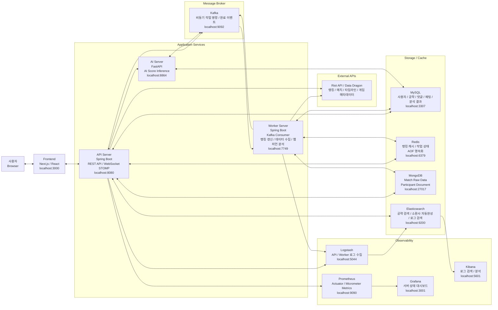
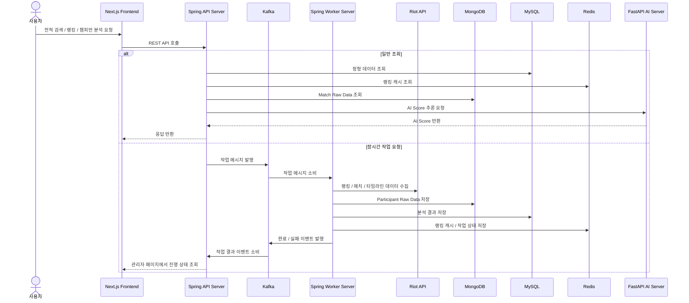

# Arcane System Architecture

```mermaid
flowchart LR
    User["사용자<br/>Browser"] <--> Frontend["Frontend<br/>Next.js / React<br/>localhost:3000"]

    Frontend <--> API["API Server<br/>Spring Boot<br/>REST API / WebSocket STOMP<br/>localhost:8080"]

    subgraph App["Application Services"]
        API
        Worker["Worker Server<br/>Spring Boot<br/>Kafka Consumer<br/>랭킹 갱신 / 데이터 수집 / 챔피언 분석<br/>localhost:7749"]
        AI["AI Server<br/>FastAPI<br/>AI Score Inference<br/>localhost:8864"]
    end

    subgraph Messaging["Message Broker"]
        Kafka["Kafka<br/>비동기 작업 명령 / 완료 이벤트<br/>localhost:9092"]
    end

    subgraph Storage["Storage / Cache"]
        MySQL["MySQL<br/>사용자 / 공략 / 댓글 / 채팅 / 분석 결과<br/>localhost:3307"]
        Redis["Redis<br/>랭킹 캐시 / 작업 상태<br/>AOF 영속화<br/>localhost:6379"]
        MongoDB["MongoDB<br/>Match Raw Data<br/>Participant Document<br/>localhost:27017"]
        Elasticsearch["Elasticsearch<br/>공략 검색 / 소환사 자동완성 / 로그 검색<br/>localhost:9200"]
    end

    subgraph External["External APIs"]
        Riot["Riot API / Data Dragon<br/>랭킹 / 매치 / 타임라인 / 게임 메타데이터"]
    end

    subgraph Observability["Observability"]
        Prometheus["Prometheus<br/>Actuator / Micrometer Metrics<br/>localhost:9090"]
        Grafana["Grafana<br/>서버 상태 대시보드<br/>localhost:3001"]
        Logstash["Logstash<br/>API / Worker 로그 수집<br/>localhost:5044"]
        Kibana["Kibana<br/>로그 검색 / 분석<br/>localhost:5601"]
    end

    API <--> MySQL
    API <--> Redis
    API <--> MongoDB
    API <--> Elasticsearch
    API <--> AI
    API --> Kafka

    Kafka --> Worker
    Worker --> Kafka
    Worker <--> MySQL
    Worker <--> Redis
    Worker <--> MongoDB
    Worker --> Riot

    AI <--> Kafka
    AI <--> MySQL

    API --> Riot

    API --> Prometheus
    Prometheus --> Grafana
    API --> Logstash
    Worker --> Logstash
    Logstash --> Elasticsearch
    Elasticsearch --> Kibana
```

## Core Flow

```mermaid
sequenceDiagram
    actor User as 사용자
    participant FE as Next.js Frontend
    participant API as Spring API Server
    participant Kafka as Kafka
    participant Worker as Spring Worker Server
    participant Riot as Riot API
    participant Mongo as MongoDB
    participant MySQL as MySQL
    participant Redis as Redis
    participant AI as FastAPI AI Server

    User->>FE: 전적 검색 / 랭킹 / 챔피언 분석 요청
    FE->>API: REST API 호출

    alt 일반 조회
        API->>MySQL: 정형 데이터 조회
        API->>Redis: 랭킹 캐시 조회
        API->>Mongo: Match Raw Data 조회
        API->>AI: AI Score 추론 요청
        AI-->>API: AI Score 반환
        API-->>FE: 응답 반환
    else 장시간 작업 요청
        API->>Kafka: 작업 메시지 발행
        Kafka->>Worker: 작업 메시지 소비
        Worker->>Riot: 랭킹 / 매치 / 타임라인 데이터 수집
        Worker->>Mongo: Participant Raw Data 저장
        Worker->>MySQL: 분석 결과 저장
        Worker->>Redis: 랭킹 캐시 / 작업 상태 저장
        Worker->>Kafka: 완료 / 실패 이벤트 발행
        Kafka->>API: 작업 결과 이벤트 소비
        API-->>FE: 관리자 페이지에서 진행 상태 조회
    end
```

