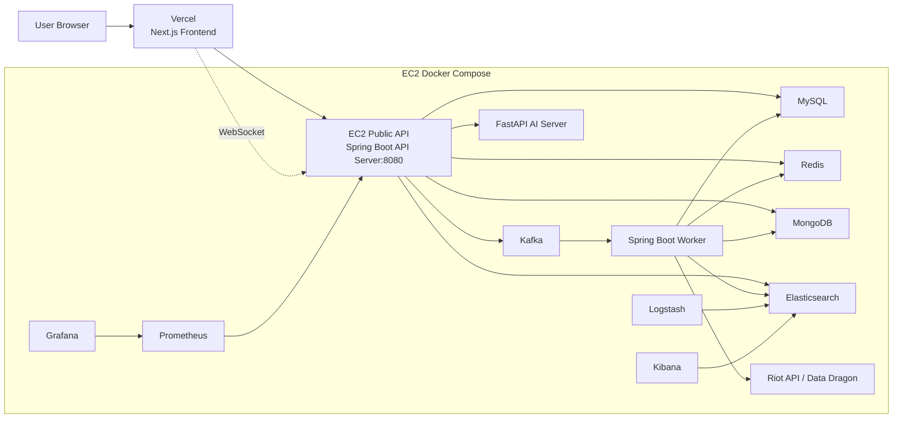

# Vercel Frontend + EC2 Backend Deployment

이 배포 구조에서는 프론트엔드는 Vercel에 올리고, API Server / Worker Server / AI Server / MySQL / Redis / Kafka / MongoDB / Elasticsearch / Logstash / Kibana / Prometheus / Grafana는 EC2에서 Docker Compose로 실행한다.

## 1. 구조



## 2. Vercel 설정

Vercel 프로젝트의 Environment Variables에 아래 값을 넣는다.

```properties
NEXT_PUBLIC_API_URL=https://api.your-domain.com
NEXT_PUBLIC_DDRAGON_VERSION=latest
```

Arcane 운영 환경에서는 아래 값을 사용한다.

```properties
NEXT_PUBLIC_API_URL=https://api.ar-cane.site
```

도메인이 없다면 임시로 아래처럼 EC2 public IP를 직접 사용할 수 있다.

```properties
NEXT_PUBLIC_API_URL=http://your-ec2-public-ip:8080
```

채팅 WebSocket 주소는 프론트 코드에서 `NEXT_PUBLIC_API_URL`을 기준으로 자동 변환된다.

- `https://api.your-domain.com` -> `wss://api.your-domain.com/ws/chat`
- `http://your-ec2-public-ip:8080` -> `ws://your-ec2-public-ip:8080/ws/chat`

## 3. EC2 설정

EC2에서 루트 경로에 `.env.ec2`를 만든다.

```bash
cp .env.ec2.example .env.ec2
```

반드시 아래 값은 실제 값으로 바꾼다.

```properties
APP_CORS_ALLOWED_ORIGIN_PATTERNS=https://your-arcane-frontend.vercel.app
OAUTH2_SUCCESS_REDIRECT_URI=https://your-arcane-frontend.vercel.app/oauth/callback
OAUTH2_FAILURE_REDIRECT_URI=https://your-arcane-frontend.vercel.app/oauth/callback
SPRING_DATASOURCE_PASSWORD=...
JWT_SECRET=...
JWT_PASSWORD=...
RIOT_API_KEY=...
GOOGLE_CLIENT_ID=...
GOOGLE_CLIENT_SECRET=...
NAVER_CLIENT_ID=...
NAVER_CLIENT_SECRET=...
```

Vercel preview URL까지 허용하려면 comma로 추가한다.

```properties
APP_CORS_ALLOWED_ORIGIN_PATTERNS=https://your-arcane-frontend.vercel.app,https://*.vercel.app
```

Arcane 운영 환경에서는 아래 프론트 origin을 기준으로 설정한다.

```properties
FRONTEND_ORIGIN=https://www.ar-cane.site
APP_CORS_ALLOWED_ORIGIN_PATTERNS=https://www.ar-cane.site
OAUTH2_SUCCESS_REDIRECT_URI=https://www.ar-cane.site/oauth/callback
OAUTH2_FAILURE_REDIRECT_URI=https://www.ar-cane.site/oauth/callback
```

## 4. EC2 실행

```bash
docker compose --env-file .env.ec2 -f docker-compose.ec2.yml up -d
```

상태 확인:

```bash
docker compose --env-file .env.ec2 -f docker-compose.ec2.yml ps
```

API health 확인:

```bash
curl http://localhost:8080/actuator/health
```

EC2에서 이미지를 직접 빌드해야 하는 경우에만 build override를 함께 사용한다.

```bash
docker compose --env-file .env.ec2 -f docker-compose.ec2.yml -f docker-compose.ec2.build.yml up -d --build
```

GitHub Actions 배포에서는 GHCR에 올라간 이미지를 pull하므로 build override를 사용하지 않는다.

EC2 보안 그룹에서는 최소한 API 포트만 외부에 열어둔다.

- `8080`: Vercel에서 호출할 API
- `3001`, `5601`, `9090`, `9200`, `3307`, `6379`, `27017`, `9092` 등은 기본적으로 외부 개방하지 않는다.

## 5. Nginx HTTPS / WebSocket 프록시

EC2에서 `api.ar-cane.site`를 Nginx로 HTTPS 프록시할 때는 WebSocket Upgrade 헤더를 반드시 넘겨야 한다.
이 설정이 빠지면 Spring Boot 로그에 아래 오류가 5초 간격으로 반복될 수 있다.

```text
Handshake failed due to invalid Upgrade header: null
```

예시 설정은 `docker/nginx/api.ar-cane.site.conf.example`에 있다.

핵심 설정은 아래와 같다.

```nginx
location / {
    proxy_pass http://127.0.0.1:8080;
    proxy_http_version 1.1;

    proxy_set_header Upgrade $http_upgrade;
    proxy_set_header Connection "upgrade";

    proxy_set_header Host $host;
    proxy_set_header X-Real-IP $remote_addr;
    proxy_set_header X-Forwarded-For $proxy_add_x_forwarded_for;
    proxy_set_header X-Forwarded-Proto $scheme;

    proxy_read_timeout 3600;
    proxy_send_timeout 3600;
}
```

EC2에서 설정 반영 후에는 아래 명령으로 검증하고 재로드한다.

```bash
sudo nginx -t
sudo systemctl reload nginx
```

설정 반영 후 WebSocket handshake를 아래처럼 검증한다.

```bash
curl -i --http1.1 -N \
  -H "Origin: https://www.ar-cane.site" \
  -H "Connection: Upgrade" \
  -H "Upgrade: websocket" \
  -H "Sec-WebSocket-Key: dGhlIHNhbXBsZSBub25jZQ==" \
  -H "Sec-WebSocket-Version: 13" \
  https://api.ar-cane.site/ws/chat
```

정상 응답은 아래와 같다.

```text
HTTP/1.1 101
Upgrade: websocket
```

만약 `302 Location: https://api.ar-cane.site/login`이 나오면 Spring Security가 WebSocket handshake를 로그인 필요 요청으로 처리한 것이다. 이 경우 API 서버의 Security 설정에서 `/ws/**`가 permit 처리되어 있는지 확인한다.

## 6. 로컬 개발과의 차이

- `docker-compose.yml`: 로컬에서 프론트까지 한 번에 띄우는 개발용 compose
- `docker-compose.ec2.yml`: EC2에서 프론트를 제외하고 백엔드/인프라 이미지를 실행하는 배포용 compose
- `docker-compose.ec2.build.yml`: EC2에서 이미지를 직접 빌드할 때만 사용하는 compose override
- `frontend/Arcane_Frontend/.env.example`: Vercel 환경변수 예시
- `.env.ec2.example`: EC2 Docker Compose 환경변수 예시

## 7. 배포 체크리스트

- Vercel `NEXT_PUBLIC_API_URL`이 EC2 API 주소를 바라보는지 확인
- EC2 `.env.ec2`의 `APP_CORS_ALLOWED_ORIGIN_PATTERNS`에 Vercel origin이 포함됐는지 확인
- OAuth 성공/실패 redirect URI가 Vercel `/oauth/callback`으로 설정됐는지 확인
- Google/Naver 개발자 콘솔에는 EC2 API 서버의 OAuth callback URL이 등록됐는지 확인
  - Google: `https://api.your-domain.com/login/oauth2/code/google`
  - Naver: `https://api.your-domain.com/login/oauth2/code/naver`
- Redis volume이 유지되는지 확인
- MySQL/MongoDB volume이 유지되는지 확인
- Kafka bootstrap server는 컨테이너 내부에서 `kafka:19092`를 쓰는지 확인
- Riot Production API Key 검증 파일이 `https://www.ar-cane.site/riot.txt`에서 열리는지 확인
